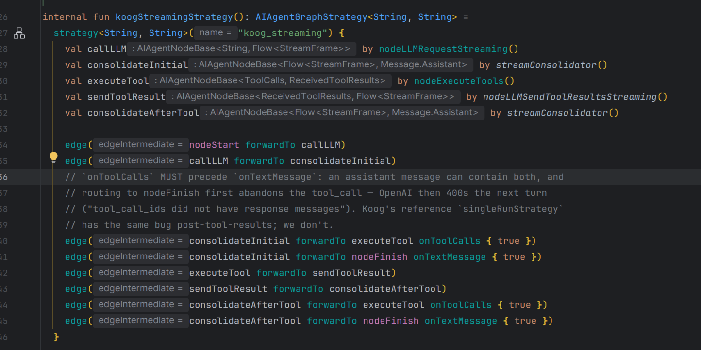
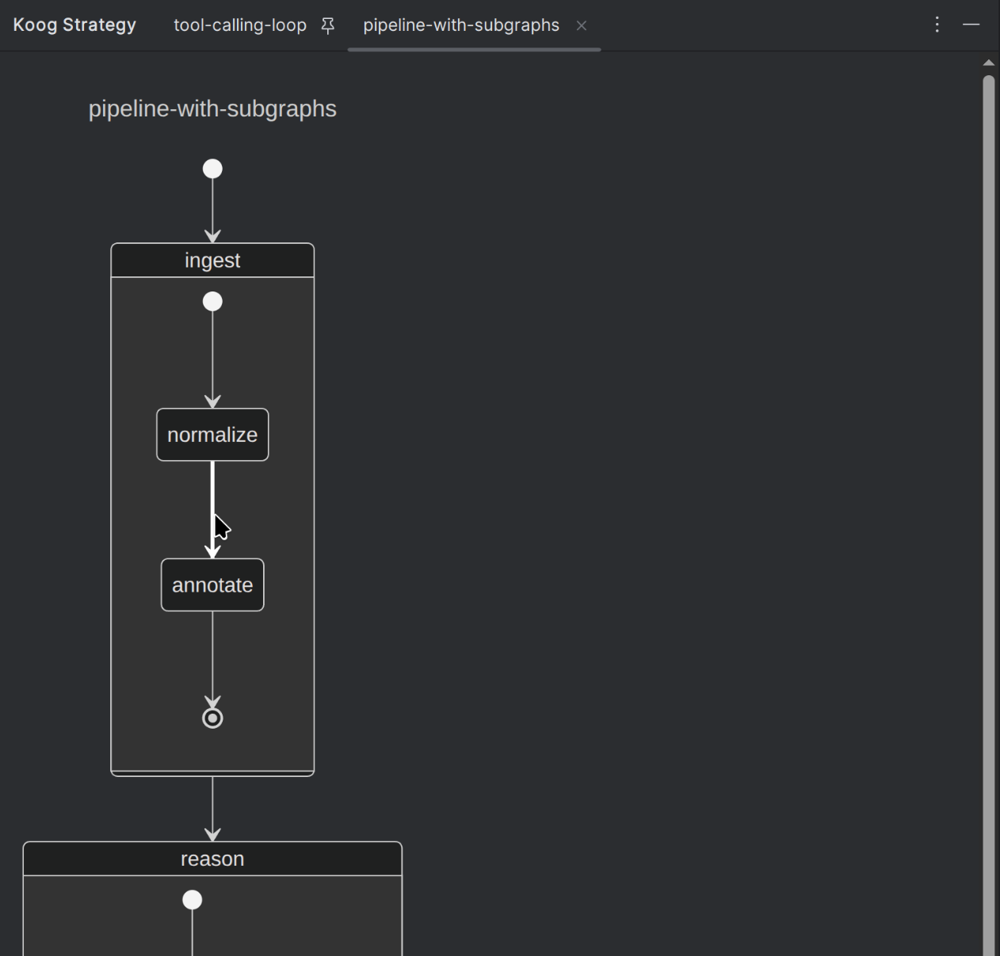

# Koog Strategy Graph

An IntelliJ Platform plugin that visualizes
[Koog](https://github.com/JetBrains/koog) agent `strategy { ... }` DSL blocks
as a live, navigable diagram inside a dedicated tool window. The diagram is
produced by Koog's own `MermaidDiagramGenerator`, so what you see is exactly
how Koog interprets the strategy — not a separate re-implementation that can
drift out of sync.

## Why

Koog strategies are easy to write and hard to read once they grow past a
handful of nodes. The control flow lives inside `edge(a forwardTo b)` calls
scattered through a lambda; spotting unreachable nodes, accidental cycles, or
missing edges by eye gets old fast. This plugin renders the underlying graph
right next to the code, refreshes it as you type, and lets you click any node
or edge to jump back to its source.

## How it works

Rather than parse the DSL and guess at the layout, the plugin runs Koog:

1. It lifts the file containing your `strategy { }` into a temporary standalone
   program, appending a `main()` that obtains the strategy and calls
   `MermaidDiagramGenerator.generate(...)`.
2. Any parameters or external dependencies the enclosing function needs are
   supplied with `mockk(relaxed = true)`, so the snippet compiles without your
   having to wire up a real agent.
3. The snippet is compiled with the IDE's **bundled Kotlin compiler** against
   your module's classpath (including its Koog version) and run in a
   subprocess. `-Xfriend-paths` is used so `internal` declarations resolve.
4. The emitted Mermaid `stateDiagram` is rendered in an embedded JCEF browser
   using a bundled `mermaid.min.js`.

Because it actually compiles and runs the strategy, **the diagram only renders
for code that compiles.** When the code doesn't compile, or Koog rejects the
graph (e.g. an unreachable finish node), the last good diagram stays on screen
and the errors are listed in a Problems-style panel beneath it.

## At a glance

A gutter icon appears next to every recognized `strategy(...)` call:



Click it and the graph loads into the **Koog Strategy** tool window:



## Features

- **Recognizes** every `strategy<I, O>("name") { ... }` block and renders it
  via Koog's `MermaidDiagramGenerator`, including nested `subgraph { }`
  composite states and on-edge condition labels.
- **Live refresh** — the diagram regenerates as you edit (debounced). While the
  code is mid-edit or doesn't compile, the previous valid diagram is kept so the
  view never blanks out.
- **Click to navigate** — click any node to jump to its `val x by ...`
  declaration; click any edge to jump to the matching
  `edge(a forwardTo b)` call. Edges have a generous invisible hit area and
  highlight on hover, so you don't need pixel-perfect aim. Edges to/from
  `nodeStart` / `nodeFinish` and into subgraphs navigate too.
- **Problems panel** — graph-validation and compilation errors appear in a
  Problems-style table under the diagram, each row carrying the full message as
  a tooltip, without discarding the current diagram.
- **Copy Mermaid source** — a toolbar button copies the generated Mermaid code
  to the clipboard for pasting into docs, mermaid.live, etc.
- **Pinnable tabs** — clicking a different gutter icon reuses the current tab,
  unless you pin it (standard pin / close affordances on the tab header), so you
  can keep several strategies side by side like search results.
- **K1 + K2 compatible** — runs in both Kotlin plugin modes without
  reconfiguration. The plugin only walks syntactic PSI (`KtCallExpression`,
  `KtProperty`, `KtBinaryExpression`); no Analysis API required.
- **Theme-aware** — the rendered page tracks Light / Dark IDE themes.

## Installation

### From a built ZIP (until the Marketplace listing is approved)

```bash
./gradlew buildPlugin
```

Then in your IDE:

*Settings → Plugins → ⚙ → Install Plugin from Disk…* — point at
`build/distributions/koog-strategy-graph-plugin-<version>.zip`. Restart the
IDE when prompted.

### From the JetBrains Marketplace

*(Coming after the first review pass — see [PUBLISHING.md](PUBLISHING.md).)*

## Usage

1. Open a Kotlin file with a `strategy { }` block, in a module that depends on
   Koog and has been built at least once (the diagram is compiled against the
   module's output and classpath).
2. A small hierarchy icon appears in the gutter on the `strategy(` line.
3. Click it. The **Koog Strategy** tool window opens (right side by default —
   drag the tab or right-click → *Float* to detach). The first render compiles
   and runs the snippet, so it takes a moment; subsequent renders of unchanged
   code are served from cache instantly.
4. Interact:
   - **Click** a node → caret jumps to its `val x by ...` declaration.
   - **Click** an edge → caret jumps to the matching `edge(a forwardTo b)`
     call.
   - **Copy** button (top-right) → puts the Mermaid source on the clipboard.
   - Edit the code → the diagram refreshes automatically.
   - **Pin** a tab to keep it; otherwise the next gutter click reuses it.
   - Close via the tab's X.

The [koog-sample](../koog-sample) project (if present alongside this repo)
contains strategies of varying complexity — simple pipelines, nested
subgraphs, and intentionally erroneous graphs — useful for exercising the
renderer and the Problems panel.

## Compatibility

| Component         | Version                                    |
|-------------------|--------------------------------------------|
| IDE family        | IntelliJ IDEA Community / Ultimate         |
| Build range       | 261+ (IntelliJ 2026.1 and later)           |
| Kotlin plugin     | Required; works in both K1 and K2 modes    |
| JCEF              | Required for the interactive diagram (falls back to plain text) |
| JDK               | 21 (matches the bundled JBR)               |

The plugin reuses the IDE's bundled Kotlin compiler and bundles `mockk`
(plus byte-buddy / objenesis) as separate `lib/` jars for stubbing strategy
parameters. Other JetBrains IDEs that bundle the Kotlin plugin (Android Studio,
etc.) may work but are not currently tested by `verifyPlugin`.

## Building from source

```bash
./gradlew buildPlugin     # produces build/distributions/*.zip
./gradlew test            # parser tests (BasePlatformTestCase fixture)
./gradlew runIde          # launches a sandbox IDE with the plugin installed
./gradlew verifyPlugin    # JetBrains marketplace plugin verifier
```

> **Note:** alternating `runIde` with `buildPlugin`/`verifyPlugin` can corrupt
> Gradle's IDE-distribution transform cache (Gradle's "immutable workspace …
> has been modified" / failed-to-deserialize-analysis errors). If that happens,
> delete the offending directory under
> `~/.gradle/caches/<gradle-version>/transforms/<hash>` and rebuild.

Detailed walkthrough — sample fixtures, hot-iteration tips, debugger attach,
log locations — is in [TESTING.md](TESTING.md).

## Design

```
KtCallExpression  →  StrategySnippet   (lift file + synthesize main() + mockk)
                            ↓
                     MermaidExporter    (compile via bundled kotlinc + run;
                            ↓                CompilerDaemon keeps a warm worker JVM)
                     Mermaid stateDiagram text
                            ↓
                     MermaidView        (JCEF + bundled mermaid.min.js)
                            ↓
                     StrategyDiagramPanel (diagram + Problems table + copy)
                            ↓
                     Tool window content (pinnable per-strategy tabs)
```

Click-to-navigate is wired back from the page: rendered nodes and edges carry
their Koog ids, a `JBCefJSQuery` channel reports the clicked id to the IDE, and
`KoogGraphService` resolves it to the matching `KtProperty` /
`forwardTo` expression and navigates there.

[GOAL.md](GOAL.md) states the original requirements.

## Publishing

`./gradlew publishPlugin` ships a new version to the JetBrains Marketplace
once a token is set. Sideloading for personal or team use is documented
alongside in [PUBLISHING.md](PUBLISHING.md).

## License

TBD — the repository does not currently declare a license. Add a `LICENSE`
file before publishing to the Marketplace if you intend the plugin to be
redistributable.
