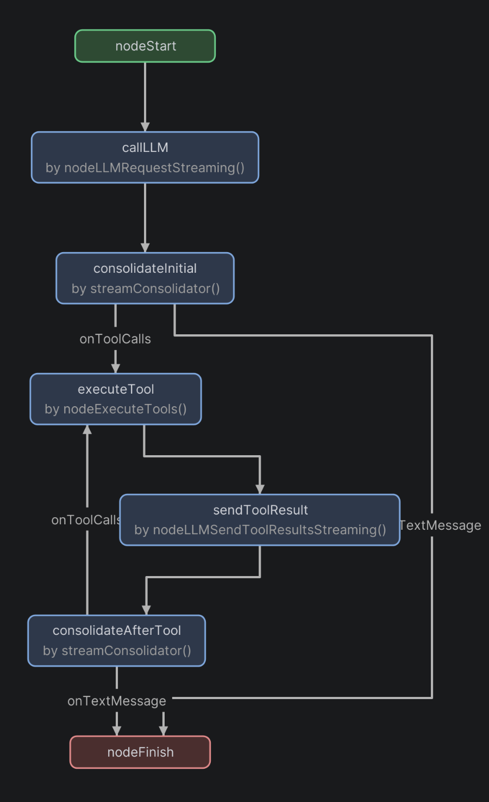

# Koog Strategy Graph

An IntelliJ Platform plugin that visualizes
[Koog](https://github.com/JetBrains/koog) agent `strategy { ... }` DSL blocks
as a live, navigable graph inside a dedicated tool window. No external tools
required — layout is computed by the Eclipse Layout Kernel, rendering is pure
Swing.

## Why

Koog strategies are easy to write and hard to read once they grow past a
handful of nodes. The control flow lives inside `edge(a forwardTo b)` calls
scattered through a lambda; spotting unreachable nodes, accidental cycles, or
missing edges by eye gets old fast. This plugin renders the underlying graph
right next to the code, with one click to jump back to any node or edge.

## At a glance

A gutter icon appears next to every recognized `strategy(...)` call:


Click it and the graph loads into the **Koog Strategy** tool window:



## Features

- **Recognizes** every `strategy<I, O>("name") { ... }` block, parses node
  declarations (`val x by nodeXxx()`) and edges (`edge(a forwardTo b)` plus
  any chained `onToolCalls { ... }` / `onTextMessage { ... }` predicates).
- **Layered layout** via the Eclipse Layout Kernel; orthogonal edge routing
  with on-edge condition labels.
- **Click to navigate** — click any node to jump to its `val` declaration;
  click any edge to jump to the matching `edge(...)` call.
- **Instant tooltips** on edges with the full predicate lambda — no Swing
  delay.
- **Zoom and pan** — mouse wheel pivots zoom around the cursor; left-drag
  pans. Resizing the tool window re-fits the diagram until the first manual
  zoom or pan.
- **K1 + K2 compatible** — runs in both Kotlin plugin modes without
  reconfiguration. The plugin only walks syntactic PSI; no Analysis API
  required.
- **HiDPI-aware** — all fonts, padding, and spacing flow through
  `JBFont` / `JBUIScale`, so it follows your IDE's UI scale on Linux/X11
  HiDPI as well as macOS and Windows.
- **Theme-aware** — graph colors come from `JBColor`, so the diagram tracks
  Light / Dark / High-Contrast IDE themes.

## Installation

### From a built ZIP (until the Marketplace listing is approved)

```bash
./gradlew buildPlugin
```

Then in your IDE:

*Settings → Plugins → ⚙ → Install Plugin from Disk…* — point at
`build/distributions/koog-strategy-graph-plugin-<version>.zip`. Restart the
IDE when prompted.

### From the JetBrains Marketplace

*(Coming after the first review pass — see [PUBLISHING.md](PUBLISHING.md).)*

## Usage

1. Open a Kotlin file with a `strategy { }` block.
2. A small hierarchy icon appears in the gutter on the `strategy(` line.
3. Click it. The **Koog Strategy** tool window opens (right side by default —
   drag the tab or right-click → *Float* to detach).
4. Interact:
   - **Click** a node → caret jumps to its `val x by ...` declaration.
   - **Click** an edge → caret jumps to the matching `edge(a forwardTo b)`
     call.
   - **Hover** an edge → tooltip shows the predicate lambda verbatim.
   - **Mouse wheel** → zoom around the cursor.
   - **Left-drag** → pan.
   - Resize the tool window → fits the graph (until you zoom or pan).
   - Close via the tool window's standard X.
5. Clicking a different gutter icon replaces the contents.

A paste-ready big-graph example lives in [TESTING.md](TESTING.md) under
*Big fixture* — useful for stress-testing the layout.

## Compatibility

| Component         | Version                                    |
|-------------------|--------------------------------------------|
| IDE family        | IntelliJ IDEA Community / Ultimate         |
| Build range       | 242+ (IntelliJ 2024.2 and later)           |
| Kotlin plugin     | Required; works in both K1 and K2 modes    |
| JDK               | 21 (matches the JBR shipped with 2024.2+)  |

Other JetBrains IDEs that bundle the Kotlin plugin (Android Studio, etc.)
should work but are not currently tested by `verifyPlugin`.

## Building from source

```bash
./gradlew buildPlugin     # produces build/distributions/*.zip
./gradlew test            # 3 parser tests (BasePlatformTestCase fixture)
./gradlew runIde          # launches a sandbox IDE with the plugin installed
./gradlew verifyPlugin    # JetBrains marketplace plugin verifier
```

Detailed walkthrough — sample fixtures, hot-iteration tips, debugger attach,
log locations — is in [TESTING.md](TESTING.md).

## Design

The architecture and the library trade-offs (why ELK + Swing over JGraphX,
graphviz-java, or JUNG) are documented in [PLAN.md](PLAN.md). [GOAL.md](GOAL.md)
states the original requirements.

In short:

```
KtCallExpression  →  StrategyParser  →  StrategyGraph
                                              ↓
                                         ElkLayout   (ELK layered + orthogonal)
                                              ↓
                                         LaidOutGraph
                                              ↓
                                         GraphPanel  (pure Swing painter)
                                              ↓
                                         Tool window content
```

## Publishing

`./gradlew publishPlugin` ships a new version to the JetBrains Marketplace
once a token is set. Sideloading for personal or team use is documented
alongside in [PUBLISHING.md](PUBLISHING.md).

## License

TBD — the repository does not currently declare a license. Add a `LICENSE`
file before publishing to the Marketplace if you intend the plugin to be
redistributable.
